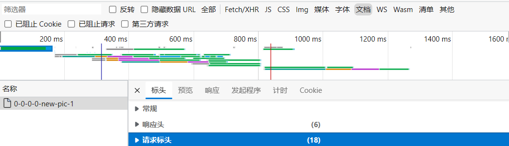
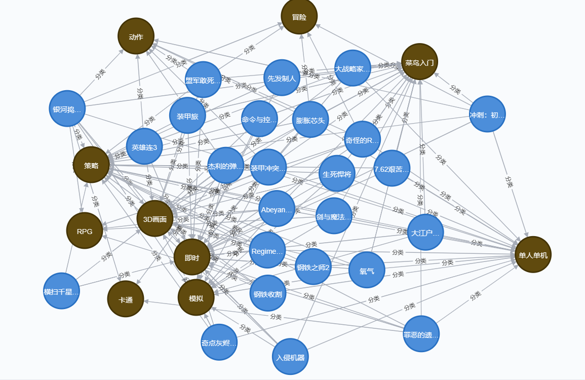

## 知识图谱实际项目一

这几天都在学习知识图谱的相关技术

本篇博客先简述知识图谱的相关知识，然后分析一个我自己写的 Demo

## 知识图谱基础知识

知识图谱是一种结构化的知识表示方法，相比于文本更易于被机器查询和处理

知识图谱的构建是一个浩大的工程，从大方面来讲，分为 **知识获取、知识融合、知识验证、知识计算和应用** 几个部分 

**数据支持层**：选什么样的数据库以及怎么设计 schema（模式）

+ 关系数据库
+ NoSQL 数据库
+ 内存数据库
+ mongo 数据库（一种分布式数据库）
+ 图数据库（Neo4J）

**知识抽取层**：对不同种类的数据用不同的技术提取

+ 从结构化数据库中获取知识：D2R
+ 从链接数据中获取知识：图映射
+ 从半结构化（网站）数据中获取知识：使用包装器
+ 从纯文本中获取知识：信息抽取（包括：**实体识别、实体链接、实体关系识别、概念抽取**）

**知识融合层**：将不同数据源获取的知识进行融合构建数据之间的关联

+ 实体对齐
+ 属性对齐
+ 冲突消解
+ 规范化

**知识验证层**：分为 **补全、纠错、外链、更新** 各部分，确保知识图谱的 **一致性和准确性** 

**知识计算和应用**：

+ **本体或者规则推理**：技术可以获取数据中存在的隐含知识
+ **链接预测**：预测实体间隐含的关系
+ **社区计算**：在知识网络上计算获取知识图谱上存在的社区，提供知识间关联的路径……
+ **知识计算知识图谱**：可以产生大量的智能应用如专家系统、推荐系统、语义搜索、问答等

## 知识图谱项目

本项目就只有两个部分：

+ 爬虫（使用 `requests` 模块 + 正则表达式）
+ 知识图谱（使用 Neo4J 数据库）

**爬虫**

爬虫的目标网站为 https://down.ali213.net/pcgame

简单 F12 分析一下，然后直接正则匹配就好（我个人比较喜欢用 `.*?` 进行匹配）

 

+ 请求头的信息可以抓包查看

有一个需要注意的点就是中文乱码问题，在 Python 使用如下代码来查看网页 html 的编码方式

```python
def test(self):
    res = requests.get(self.target_url, headers)
    print(res.encoding)
```

```c
ISO-8859-1
```

最后把爬取的信息存储在文件中

爬虫的代码如下：

```python
# -*- coding: utf-8 -*-#

import os
from time import sleep
from lxml import etree
import requests, re
from urllib.parse import urljoin, urlencode
import pprint

headers = {
    'Accept': 'text/html,application/xhtml+xml,application/xml;q=0.9,image/webp,image/apng,*/*;q=0.8,application/signed-exchange;v=b3;q=0.7',
    'Cookie': '',
    'User-Agent': 'Mozilla/5.0 (Windows NT 10.0; Win64; x64) AppleWebKit/537.36 (KHTML, like Gecko) Chrome/110.0.0.0 Safari/537.36 Edg/110.0.1587.57',
}

class Crawler:
    target_url = 'https://down.ali213.net/pcgame/all/0-0-0-0-new-pic-'
    name = 0
    time = 0
    size = 0
    language = 0
    content = 0

    def get_base_html(self,get):
        if get:
            res = requests.get(self.base_url,headers)
            text = res.text.encode('iso-8859-1').decode('utf-8')
            return text
        else:
            text = open('base_html.txt', encoding='utf8').read()
            return text

    def create_list(self):
        base_html = self.get_base_html(1)
        name_list = re.findall('<div class="game-name">(.*?)</div>', base_html)
        time_list = re.findall('<div>时间：<span>(.*?)</span>', base_html)
        size_list = re.findall('<div>大小：<span>(.*?)</span>', base_html)
        language_list = re.findall('<span class="game-lang">(.*?)</span>', base_html)
        content_list = []

        for i in re.findall('</div><p>(.*?)</p></div>', base_html):
            content_list.append(re.findall('<span>(.*?)</span>', i))

        for i in list(zip(name_list,time_list,size_list,language_list,content_list)):
            print(i)

        for i in range(len(name_list)):
            self.name.write(str(name_list[i]) + "\n")
            self.time.write(str(time_list[i]) + "\n")
            self.size.write(str(size_list[i]) + "\n")
            self.language.write(str(language_list[i]) + "\n")
            self.content.write(str(content_list[i])[1:-1].replace(',','').replace('\'','') + "\n")

    def run(self):
        self.name = open('data/name.txt', 'w', encoding='utf8')
        self.time = open('data/time.txt', 'w', encoding='utf8')
        self.size = open('data/size.txt', 'w', encoding='utf8')
        self.language = open('data/language.txt', 'w', encoding='utf8')
        self.content = open('data/content.txt', 'w', encoding='utf8')
        for i in range(80):
            self.base_url = self.target_url+str(i+1)
            print("now is "+self.base_url)
            self.create_list()

    def test(self):
        res = requests.get(self.target_url, headers)
        print(res.encoding)

if __name__ == '__main__':
    cra = Crawler()
    cra.run()
```

**知识图谱**

我自己实现的知识图谱比较简单，其核心思想就是：读取爬取的数据，将其格式化为 Cypher 后发送给 Neo4j

+ 刚开始时不了解 Cypher 的语法，遇到了很多问题：
  + 匹配不到节点
  + 删除重复节点
  + 删除重复关系
+ 不过这些问题在网上都有解决的办法

本知识图谱有两个主体 `游戏名称 游戏标签`，两者用 `分类` 关系进行连接

建立 `游戏名称` 节点时不用特殊处理，因为在爬虫爬取的过程中就不会有重复，但 `游戏标签` 中存在大量的重复，简单遍历后去重很影响效率，于是我就把 “建立节点” 和 “建立关系” 这两步给分开了：

+ “建立关系” 的过程很依赖数据在文本中的位置（爬取时就从上往下存放数据）
+ 先遍历文本并用列表记录 “存在的节点”，转化为 Cypher 后创建 `游戏标签` 节点
+ 然后再次遍历该文本来 “建立关系”

知识图谱的代码如下：

```python
# -*- coding: utf-8 -*-#

from py2neo import Graph,Node,Relationship
import os

classification = ['游戏名称','游戏标签']

class KG:
    name = open('data/name.txt', 'r', encoding='utf8')
    time = open('data/time.txt', 'r', encoding='utf8')
    size = open('data/size.txt', 'r', encoding='utf8')
    language = open('data/language.txt', 'r', encoding='utf8')
    content = open('data/content.txt', 'r', encoding='utf8')

    def createEntity(self,graph):
        cql = 'CREATE (n:游戏数据库{id:\'0\', name:\'游戏数据库\'}) RETURN n'
        graph.run(cql)

        for i, c in enumerate(classification):
            cql = '''
                MERGE (a:游戏数据库{id:\'%d\', name:\'%s\'})
                MERGE (b {name: '游戏数据库'}) 
                MERGE (b)-[:划分]->(a)
                ''' % (i+1, c)
            graph.run(cql)

        name_list = self.name.readlines()
        time_list = self.time.readlines()
        size_list = self.size.readlines()
        language_list = self.language.readlines()

        for i in range(len(name_list)):
            cql = """
                MERGE (:游戏名称{id:'%d', 名称:'%s', 语言:'%s', 大小:'%s', 发售时间:'%s'})
                """ % (i, name_list[i].replace('\n',''),language_list[i].replace('\n',''),
                       size_list[i].replace('\n',''),time_list[i].replace('\n',''))
            graph.run(cql)

        print("step 1 down")

        tmp_list = []

        for i in range(len(name_list)):
            content_list = self.content.readline().split(' ')
            for j in range(len(content_list)):
                if content_list[j] not in tmp_list:
                    tmp_list.append(content_list[j])
                    cql = 'MERGE (:游戏标签{标签:\'%s\'})' % (content_list[j].replace('\n',''))
                    graph.run(cql)

        print("step 2 down")

    def createreRationship(self,graph):
        self.name.seek(0)
        self.time.seek(0)
        self.size.seek(0)
        self.language.seek(0)
        self.content.seek(0)
        name_list = self.name.readlines()
        time_list = self.time.readlines()
        size_list = self.size.readlines()
        language_list = self.language.readlines()

        for i in range(len(name_list)):
            content_list = self.content.readline().split(' ')
            for j in range(len(content_list)):
                cql = """
                    MATCH (a:游戏名称{id:'%d', 名称:'%s', 语言:'%s', 大小:'%s', 发售时间:'%s'}),
                          (b:游戏标签{标签:'%s'})
                    MERGE (a)-[:分类]->(b)
                """ % (i,name_list[i].replace('\n',''),language_list[i].replace('\n',''),
                       size_list[i].replace('\n',''),time_list[i].replace('\n',''),
                       content_list[j].replace('\n',''))
                graph.run(cql)

        print("step 3 down")

        self.content.seek(0)
        for i in range(2):
            content_list = self.content.readline().split(' ')
            for j in range(len(content_list)):
                cql = """
                     MATCH (:游戏名称{id:'%d'})-[r:分类]->(:游戏标签{标签:'%s'})  
                     WITH count(r) as num,collect(r) as rel
                     WHERE num > 1
                     UNWIND tail(rel) as rels
                     DELETE rels
                 """ % (i,content_list[j])
                graph.run(cql)

        print("step 4 down")

if __name__ == '__main__':
    test_graph = Graph("http://127.0.0.1:7474/browser/", auth=("neo4j", "123456789"))
    test_graph.run('match(n) detach delete n')
    kg = KG()
    kg.createEntity(test_graph)
    kg.createreRationship(test_graph)
```

最后到达的效果如下图：

 

+ 只放了部分（总共有：300 个 `游戏名称` 节点，70 个 `游戏标签` 节点，17527 个关系）

个人感觉本项目在爬虫上下足了功夫，得到的虽然不是结构化的数据但非常好处理，于是省去了后续的 **知识抽取 知识融合 知识验证**

目前还没有学习图神经网络，基于知识图谱的应用（专家系统、推荐系统、语义搜索、问答...）暂时无法完成，之后有机会进行补充

