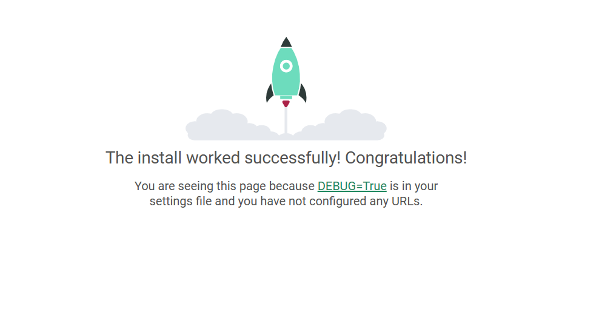
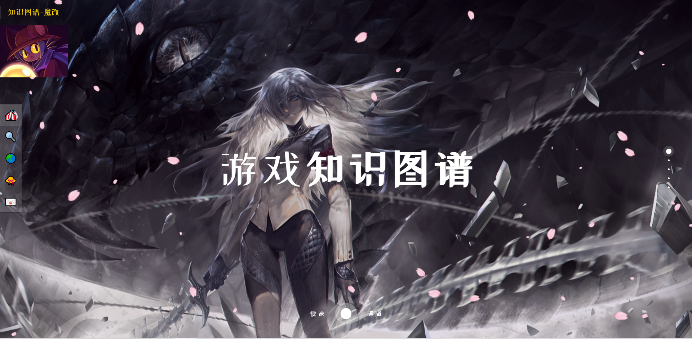
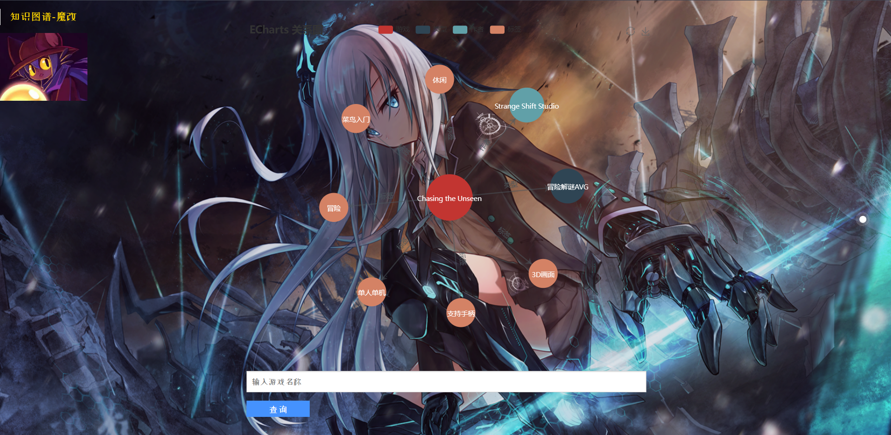
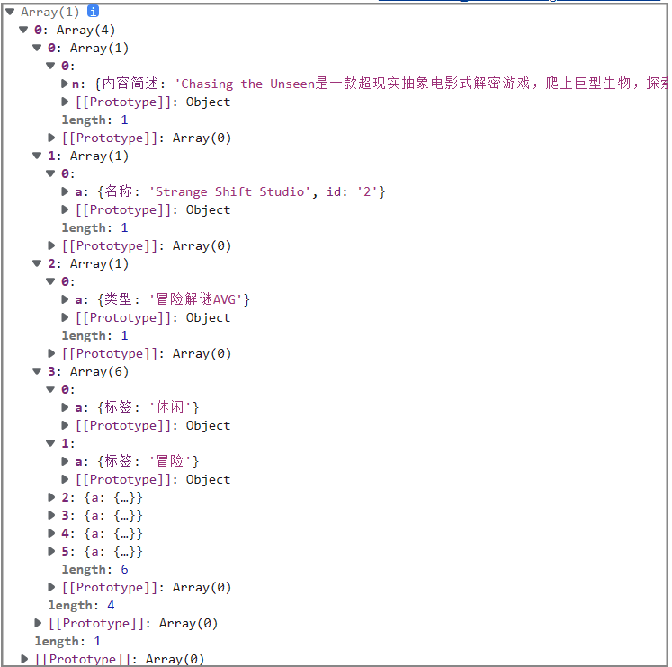

## 知识图谱实践项目二

第二代的知识图谱项目作出了如下升级：

+ 新添 `游戏作者 游戏类型` 主体
+ 改变了爬虫的逻辑，使其可以爬取更多信息（效率有损失）
+ 优化了知识图谱的关系

爬虫代码如下：

```python
# -*- coding: utf-8 -*-#

import os
from time import sleep
from lxml import etree
import requests, re
from urllib.parse import urljoin, urlencode
import pprint

headers = {
    'Accept': 'text/html,application/xhtml+xml,application/xml;q=0.9,image/webp,image/apng,*/*;q=0.8,application/signed-exchange;v=b3;q=0.7',
    'Cookie': '',
    'User-Agent': 'Mozilla/5.0 (Windows NT 10.0; Win64; x64) AppleWebKit/537.36 (KHTML, like Gecko) Chrome/110.0.0.0 Safari/537.36 Edg/110.0.1587.57',
}

class Crawler:
    target_url = 'https://down.ali213.net/pcgame/all/0-0-0-0-new-pic-'
    base_url = ''
    name_file = 0
    time_file = 0
    size_file = 0
    language_file = 0
    content_file = 0
    url_file = 0
    classify_file = 0

    def get_base_html(self,url):
        res = requests.get(url,headers)
        text = res.text.encode('iso-8859-1').decode('utf-8')
        return text

    def create_list(self):
        base_html = self.get_base_html(self.base_url)
        url_list = re.findall('<div class="famous-li"><a href="(/pcgame/.*?.html)" target="_blank" class="content-a">', base_html)

        name_list = []
        author_list = []
        language_list = []
        time_list = []
        classify_list = []

        for url in url_list:
            url_html = self.get_base_html("https://down.ali213.net/"+url)
            name_language = re.findall('<h1>(.*?)</h1>', url_html)
            author = re.findall('<li>游戏发行.(.*?)</li>', url_html)
            time = re.findall('<a href="/pcgame/all/0-0-(.*?)-0-new-pic-1.html" target', url_html)
            classify = re.findall('-new-pic-1.html" target="_blank">(.*?)</a>',url_html)
            content = re.findall('<p>\u3000\u3000(.*?)</p>',url_html)

            name_language = str(name_language[0]).rsplit(" ",1)
            name = str(name_language[0])
            language = str(name_language[1])
            author = str(author[0])
            time = str(time[0])
            del classify[1:3]

            name_list.append(name)
            author_list.append(author)
            time_list.append(time)
            language_list.append(language)
            classify_list.append(classify)

            if len(content) == 0:
                self.content_file.write('\n')
            else:
                self.content_file.write(str(content[0])+'\n')

        for i in list(zip(name_list,author_list,time_list,language_list,classify_list)):
            print(i)

        for i in range(len(name_list)):
            self.name_file.write(str(name_list[i]) + "\n")
            self.time_file.write(str(time_list[i]) + "\n")
            self.language_file.write(str(language_list[i]) + "\n")
            self.author_file.write(str(author_list[i]) + "\n")
            self.url_file.write(str(url_list[i]) + "\n")
            self.classify_file.write(str(classify_list[i])[1:-1].replace(',', '').replace('\'', '') + "\n")

    def run(self):
        self.name_file = open('data/name.txt', 'w', encoding='utf8')
        self.size_file = open('data/size.txt', 'w', encoding='utf8')
        self.author_file = open('data/author.txt', 'w', encoding='utf8')
        self.time_file = open('data/time.txt', 'w', encoding='utf8')
        self.language_file = open('data/language.txt', 'w', encoding='utf8')
        self.content_file = open('data/content.txt', 'w', encoding='utf8')
        self.url_file = open('data/url.txt', 'w', encoding='utf8')
        self.classify_file = open('data/classify.txt', 'w', encoding='utf8')
        for i in range(30):
            self.base_url = self.target_url+str(i+1)
            print("now is "+self.base_url)
            self.create_list()

    def test(self):
        res = requests.get(self.target_url, headers)
        print(res.encoding)

if __name__ == '__main__':
    cra = Crawler()
    cra.run()
```

知识图谱代码如下：

```python
# -*- coding: utf-8 -*-#

from py2neo import Graph,Node,Relationship
import os

classification = ['游戏名称','游戏标签','游戏类型','游戏作者']

class KG:
    name_file = open('data/name.txt', 'r', encoding='utf8')
    size_file = open('data/size.txt', 'r', encoding='utf8')
    author_file = open('data/author.txt', 'r', encoding='utf8')
    time_file = open('data/time.txt', 'r', encoding='utf8')
    language_file = open('data/language.txt', 'r', encoding='utf8')
    content_file = open('data/content.txt', 'r', encoding='utf8')
    url_file = open('data/url.txt', 'r', encoding='utf8')
    classify_file = open('data/classify.txt', 'r', encoding='utf8')

    def createEntity(self,graph):
        cql = '''CREATE (n:游戏数据库{id:'0', name:'游戏数据库'}) RETURN n'''
        graph.run(cql)

        for i, c in enumerate(classification):
            cql = '''
                MERGE (a:游戏数据库{id:'%d', name:'%s'})
                MERGE (b {name: '游戏数据库'}) 
                MERGE (b)-[:划分]->(a)
                ''' % (i+1, c)
            graph.run(cql)

        name_list = self.name_file.readlines()
        time_list = self.time_file.readlines()
        language_list = self.language_file.readlines()
        author_list = self.author_file.readlines()
        content_list = self.content_file.readlines()

        for i in range(len(name_list)):
            cql = """
                MERGE (:游戏名称{id:'%d',名称:"%s",语言:'%s',内容简述:'%s',发售时间:'%s'})
                """ % (i, name_list[i].replace('\n',''),
                       language_list[i].replace('\n',''),
                       content_list[i].replace('\n',''),
                       time_list[i].replace('\n',''))
            graph.run(cql)

        print("step 1 down")

        author_tmp_list = []
        for i in range(len(author_list)):
            if author_list[i] not in author_tmp_list:
                author_tmp_list.append(author_list[i])
                cql = """
                    MERGE (:游戏作者{id:'%d', 名称:"%s"})
                    """ % (i, author_list[i].replace('\n',''))
                graph.run(cql)

        print("step 2 down")

        classify_tmp_list = []
        classify_tmp_list2 = []
        for i in range(len(name_list)):
            classify_list = self.classify_file.readline().split(' ')
            for j in range(len(classify_list)-1):
                if classify_list[j+1] not in classify_tmp_list:
                    classify_tmp_list.append(classify_list[j+1])
                    cql = """
                        MERGE (:游戏标签{标签:'%s'})
                        """ % (classify_list[j+1].replace('\n',''))
                    graph.run(cql)
                if classify_list[0] not in classify_tmp_list2:
                    classify_tmp_list2.append(classify_list[0])
                    cql = """
                        MERGE (:游戏类型{类型:'%s'})
                        """ % (classify_list[0].replace('\n',''))
                    graph.run(cql)

        print("step 3 down")

    def createreRationship(self,graph):
        self.name_file.seek(0)
        self.time_file.seek(0)
        self.size_file.seek(0)
        self.language_file.seek(0)
        self.content_file.seek(0)
        self.author_file.seek(0)
        self.classify_file.seek(0)
        name_list = self.name_file.readlines()
        time_list = self.time_file.readlines()
        size_list = self.size_file.readlines()
        author_list = self.author_file.readlines()
        language_list = self.language_file.readlines()

        for i in range(len(name_list)):
            classify_file = self.classify_file.readline().split(' ')
            for j in range(len(classify_file)-1):
                cql = """
                    MATCH (a:游戏名称{id:'%d', 名称:"%s"}),
                          (b:游戏标签{标签:'%s'})
                    MERGE (b)-[:标签]->(a)
                """ % (i,name_list[i].replace('\n',''),
                       classify_file[j+1].replace('\n',''))
                graph.run(cql)

            cql = """
                MATCH (a:游戏名称{id:'%d', 名称:"%s"}),
                      (b:游戏类型{类型:'%s'})
                MERGE (b)-[:类型]->(a)
            """ % (i,name_list[i].replace('\n',''),
                    classify_file[0].replace('\n',''))
            graph.run(cql)

            cql = """
                MATCH (a:游戏名称{id:'%d', 名称:"%s"}),
                      (b:游戏作者{id:'%d', 名称:"%s"})
                MERGE (b)-[:制作]->(a)
            """ % (i,name_list[i].replace('\n',''),
                   i,author_list[i].replace('\n',''))
            graph.run(cql)

        print("step 4 down")

if __name__ == '__main__':
    test_graph = Graph("http://127.0.0.1:7474/browser/", auth=("neo4j", "123456789"))
    test_graph.run('match(n) detach delete n')
    kg = KG()
    kg.createEntity(test_graph)
    kg.createreRationship(test_graph)
```

## 基于 Django 的 Web 界面

Django 是一个由 Python 编写的开放源代码的 Web 应用框架

本篇博客先介绍一下 Django 的使用，然后展示一下我自己写的测试网页

**建立 Django 项目**

创建一个 HelloWorld 项目，使用命令行输入：

```python
django-admin startproject HelloWorld
```

- **HelloWorld:** 项目的容器
- **manage.py:** 一个实用的命令行工具，可让你以各种方式与该 Django 项目进行交互
- **HelloWorld/__init__.py:** 一个空文件，告诉 Python 该目录是一个 Python 包
- **HelloWorld/asgi.py:** 一个 ASGI 兼容的 Web 服务器的入口，以便运行你的项目
- **HelloWorld/settings.py:** 该 Django 项目的设置/配置
- **HelloWorld/urls.py:** 该 Django 项目的 URL 声明; 一份由 Django 驱动的网站"目录"
- **HelloWorld/wsgi.py:** 一个 WSGI 兼容的 Web 服务器的入口，以便运行你的项目

使用如下命令启动：

```shell
python manage.py runserver
```

在浏览器中使用如下网址：

+ [The install worked successfully! Congratulations!](http://127.0.0.1:8000/)： 

 

**在 Django 里面加载 HTML 的 CSS 样式**

对于 Django 而言，加载 HTML，Django 会通过 templates 文件夹中放置的 HTML 来加载，有时需要嵌入 CSS 和 JS 等样式

在根目录下创建一个 base_views.py 文件：

```python
from django.shortcuts import render
from django.views.decorators import csrf

# Create your views here.
def index(request):
    return render(request,'base.html')
```

修改该根目录下 urls.py 文件中的代码：

```c
from django.contrib import admin
from django.urls import re_path as url
from . import base_views

urlpatterns = [
    url(r'^$', base_views.index),
]
```

修改根目录下的 settings.py 中的代码：

```python
 'DIRS': [os.path.join(BASE_DIR,'HelloWorld/templates')],
```

+ 修改 TEMPLATES 下的 DIRS

此时 Django 默认是对 CSS、JS 的静态文件是拒绝访问的，必须要在里面进行配置才行：

+ 在你建好的 Django 的根目录下新建 static 文件夹，在下面再新建 CSS，Images 
+ 在 `settings.py` 文件进行相关配置，在 `STATIC_URL = '/static/'` 后面加入如下代码：

```python
STATICFILES_DIRS = ( os.path.join(BASE_DIR,'static'), )
```

最后需要对 html 进行修改，直接把 herf 链接写死

+ 修改前：

```css
<link rel="stylesheet" href="css/normalize.css"> 
<script src="js/sakura.js"></script>
```

+ 修改后：

```css
<link rel="stylesheet" href="/static/css/normalize.css">  
<script src="/static/js/sakura.js"></script>
```

最后对从网上下载的 HTML 进行魔改：

+ 源地址：[异次元-起点 (rnmcnm.com)](https://cs.rnmcnm.com/6/) 

效果如下：

  

 

+ 关于 HTML 的编写不是本篇博客的重点，就略过了

## 基于 Echarts 的 Neo4j 可视化

**在 Django 项目中使用 Neo4j**

Django 可以把 Neo4j 中的知识图谱显示在前端页面上

我的做法是直接定义一个类用于连接 Neo4j：

```python
class Neo4j():
	graph = None
	def __init__(self):
		print("create neo4j class ...")

	def connectDB(self):
		self.graph = Graph("http://localhost:7474",auth=("neo4j", "123456789"))
```

并在根目录下 urls.py 文件所添加的函数中使用 Neo4j 类

+ 这里使用正则表达式来匹配 URL，如果匹配成功则调用后面的函数

```python
urlpatterns = [
    url(r'^$', base_views.index),
    url(r'^detail', detail_views.searchDetail),
]
```

这种做法其实就是把 Neo4j 当成了 Django 项目中的一个子模块

**Echarts 实现知识图谱可视化**

Echarts 是用 JavaScript 实现的开源可视化库

学习这个东西可花了我不少的力气，效果如下：

 

我实现的思路就是直接在 urls.py 中添加用于实现功能的函数：

```python
urlpatterns = [
    url(r'^$', base_views.index),
    url(r'^detail', detail_views.searchDetail),
]
```

```python
def searchDetail(request):
    if (request.GET):
        entity = request.GET['user_text']
        db = Neo4j()
        db.connectDB()

        game = db.name2game(entity)

        if len(game) == 0:
            ctx = {'title': 'ctx'}
            return render(request, 'detail.html', {'ctx': json.dumps(ctx, ensure_ascii=False)})
        else:
            author = db.game2author(entity)
            classify = db.game2classify(entity)
            label = db.game2label(entity)
            entityRelation = [game, author, classify, label]

            return render(request, 'detail.html', {'entityRelation': json.dumps(entityRelation, ensure_ascii=False)})
    return render(request, 'detail.html')
```

+ 识别 URL 中的 `user_text` 并调用对应的函数（简单转换为 Cypher 语句）
+ 在 Neo4j 中查找数据，将返回的数据提交给 JavaScript 层

```python
	def name2game(self,value):
		sql = "MATCH (n:游戏名称{名称:'"+str(value)+"'}) return n;"
		answer = self.graph.run(sql).data()
		return answer

	def game2author(self,value):
		sql = "MATCH(a)-[r:制作]->(b) where b.名称 = '"+str(value)+"' RETURN a;"
		answer = self.graph.run(sql).data()
		return answer

	def game2classify(self,value):
		sql = "MATCH(a)-[r:类型]->(b) where b.名称 = '"+str(value)+"' RETURN a;"
		answer = self.graph.run(sql).data()
		return answer

	def game2label(self,value):
		sql = "MATCH(a)-[r:标签]->(b) where b.名称 = '"+str(value)+"' RETURN a;"
		answer = self.graph.run(sql).data()
		return answer
```

+ 在 JavaScript 层中识别 Django 层函数返回的数据，简单处理后交给 Echarts：

```html

<textarea style="background-color:rgba(0,0,0,0.6); font:26px 宋体; color:white;" cols="30" style="region:none" rows="18" style="region:none" >数据库中暂未添加该实体</textarea>

<div id="main" style="width:700px;height:600px"></div>
<script type="text/javascript">
    var ctx = [ {{ ctx|safe }} ] ;
    var entityRelation = [ {{ entityRelation|safe }} ] ;
    var data = [] ;
    var links = [] ;
    var game = {};
    var author = {};
    var author_link = {}
    var classify = {}
    var classify_link = {}

    console.log(entityRelation)
    game['name'] = entityRelation[0][0][0]['n']['名称'];
    game['category'] = 0;
    game['symbolSize'] = 80;
    data.push(game);

    classify['name'] = entityRelation[0][2][0]['a']['类型'];
    classify['category'] = 1;
    classify['symbolSize'] = 60;
    classify_link['name'] = "类型";
    classify_link['target'] = classify['name'];
    classify_link['source'] =  game['name'];
    data.push(classify);
    links.push(classify_link)

    author['name'] = entityRelation[0][1][0]['a']['名称'];
    author['category'] = 2;
    author['symbolSize'] = 60;
    author_link['name'] = "作者";
    author_link['target'] = author['name'];
    author_link['source'] =  game['name'];
    data.push(author);
    links.push(author_link)

    for( var i = 0 ;i < entityRelation[0][3].length ; i++ ) {
        var label = {}
        var label_link = {}
        label['name'] = entityRelation[0][3][i]['a']['标签'];
        label['category'] = 3;
        label['symbolSize'] = 50;
        label_link['name'] = "标签";
        label_link['target'] = label['name'];
        label_link['source'] =  game['name'];
        data.push(label);
        links.push(label_link);
    }

    var myChart = echarts.init(document.getElementById('main'));
    var categories = [
        {
            name: '游戏'
        }, {
            name: '类型'
        }, {
            name: '作者'
        }, {
            name: '标签'
        },
    ];

    option = {
        title: {
            text: 'ECharts 关系图'
        },
        tooltip: {
            formatter: function (x) {
                return x.data.des;
            }
        },
        toolbox: {
            show: true,
            feature: {
                mark: {
                    show: true
                },
                restore: {
                    show: true
                },
                saveAsImage: {
                    show: true
                }
            }
        },
        legend: [{
            data: categories.map(function (a) {
                return a.name;
            })
        }],
        series: [{
            type: 'graph',
            layout: 'force',
            symbolSize: 40,
            roam: true,
            edgeSymbol: ['circle', 'arrow'],
            edgeSymbolSize: [2, 10],
            edgeLabel: {
                normal: {
                    textStyle: {
                        fontSize: 20
                    }
                }
            },
            force: {
                repulsion: 2500,
                edgeLength: [10, 50]
            },
            draggable: true,
            lineStyle: {
                normal: {
                    width: 2,
                    color: '#4b565b',
                }
            },
            edgeLabel: {
                normal: {
                    show: true,
                    formatter: function (x) {
                        return x.data.name;
                    }
                }
            },
            label: {
                normal: {
                    show: true,
                    textStyle: {}
                }
            },
            data: data,
            links: links,
            categories: categories,
        }]
    };
    myChart.setOption(option);
</script>

<textarea style="background-color:rgba(0,0,0,0.6); font:26px 宋体; color:white;" cols="30" style="region:none" rows="18" style="region:none" ></textarea>
```

+ 从 `var myChart = echarts.init` 到 `myChart.setOption(option)` 都是 Echarts 的模板
+ 如果对 Django 层返回的数据不熟悉，可以直接用 `console.log(entityRelation)` 把该数据输出到控制台，并打开 F12 进行查看

 


