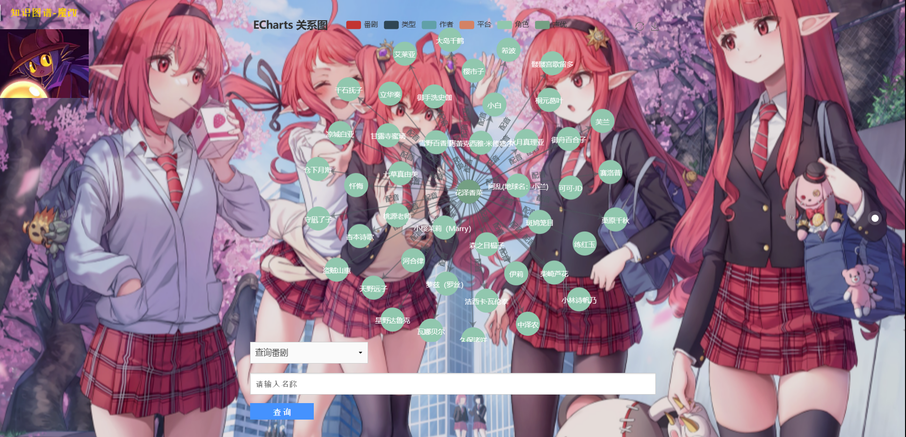
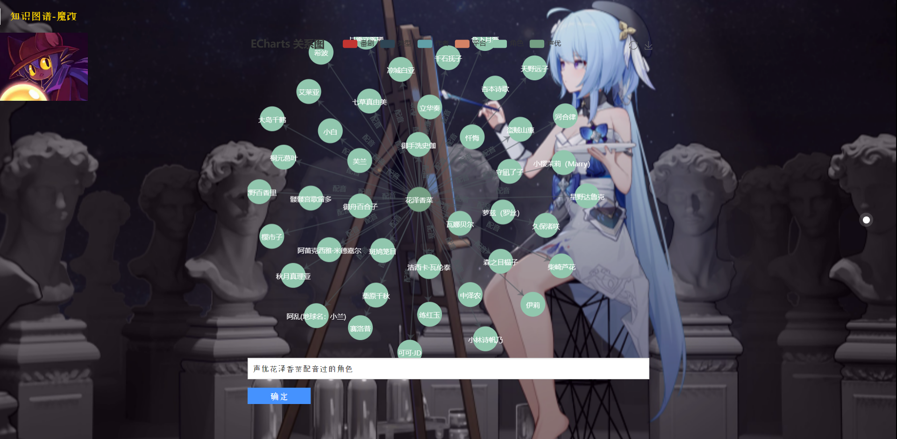
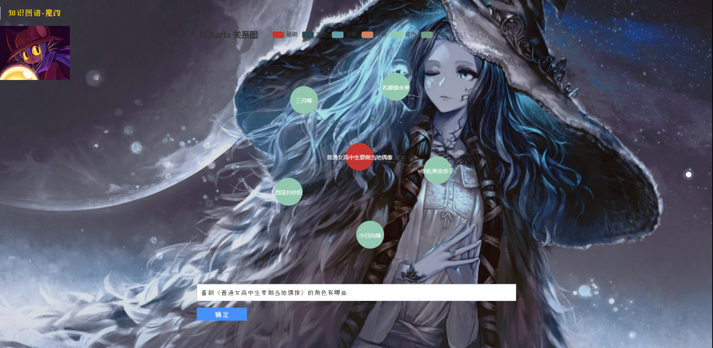
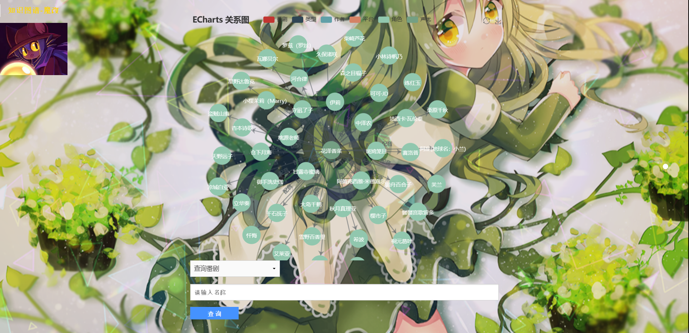

## 知识图谱实践项目三

这次爬取的目标是：[二次元动漫百科 - 白鸟ACG (bnacg.com)](https://www.bnacg.com/) （想做一个番剧知识图谱）

爬虫代码：

```python
# -*- coding: utf-8 -*-#

import os
from time import sleep
from lxml import etree
import requests, re
from urllib.parse import urljoin, urlencode
from bs4 import BeautifulSoup

headers = {
    'Accept': '',
    'Cookie': '',
    'User-Agent': ''
}

class Crawler:
    target_url = 'https://www.bnacg.com/dm/list_1_'
    base_url = ''
    name_file = 0
    platform_file = 0
    seiyuu_file = 0
    classify_file = 0
    role_name_file = 0
    role_img_file = 0
    author_file = 0

    def get_base_html(self,url):
        res = requests.get(url,headers)
        text = res.text.encode('ISO-8859-1').decode('utf-8')
        return text

    def create_list(self):
        base_html = self.get_base_html(self.base_url)
        soup = BeautifulSoup(base_html, 'html.parser')
        html = soup.findAll("ul", {"class": "result-list"})

        url_list = re.findall('<a class="img-wrap" href="(.*?)" rel="nofollow"', str(html))

        name_list = []
        author_list = []
        role_img_list = []
        role_name_list = []
        classify_list = []
        seiyuu_list =[]
        platform_list = []

        for url in url_list:
            url_html = self.get_base_html(url)
            soup = BeautifulSoup(url_html, 'html.parser')
            name = re.findall('<div class="ts18 bold"> (.*?) /', str(url_html))
            classify = re.findall('<div class="rw_ju"> <span class="bold">类型：</span>(.*?)</div>',url_html)
            role_name = re.findall('title="(.*?)" alt="',url_html)
            role_img = re.findall(' <span class="bold">人物配音：</span>(.*?)</div>',url_html)
            author = re.findall('<dd class="canshu value">(.*?)</dd>',url_html)

            for i in range(len(role_name)):
                role_name[i] = str(role_name[i]).replace(" ","")

            name_list.append(name[0])
            role_img_list.append(role_img[1:])
            role_name_list.append(role_name)
            author_list.append(author[2])
            platform_list.append(author[3])
            seiyuu_list.append(seiyuu)

            if(len(classify) != 0):
                classify_list.append(classify[0].split(','))

        #for i in list(zip(name_list,author_list,platform_list,classify_list,seiyuu_list,role_name_list,role_img_list)):
            #print(i)

        for i in range(25):
            if(len(role_img_list[i])!=len(role_img_list[i])):
                print(role_img_list[i])
                print(role_name_list[i])

        for i in range(len(name_list)):
            self.name_file.write(str(name_list[i].replace('《', '').replace('》', '')) + "\n")
            self.author_file.write(str(author_list[i].replace(' ','')) + "\n")
            self.platform_file.write(str(platform_list[i].replace(' ','')) + "\n")
            self.classify_file.write(str(classify_list[i])[1:-1].replace('\'','').replace(',','') + "\n")
            self.seiyuu_file.write(str(seiyuu_list[i])[1:-1].replace('\'', '').replace(',', '') + "\n")
            self.role_name_file.write(str(role_name_list[i])[1:-1].replace('\'', '').replace(',', '') + "\n")
            self.role_img_file.write(str(role_img_list[i])[1:-1].replace('\'', '').replace(',', '') + "\n")

    def run(self):
        self.name_file = open('data/name.txt', 'w', encoding='utf8')
        self.author_file = open('data/author.txt', 'w', encoding='utf8')
        self.role_name_file = open('data/role_name.txt', 'w', encoding='utf8')
        self.role_img_file = open('data/role_img.txt', 'w', encoding='utf8')
        self.platform_file = open('data/platform.txt', 'w', encoding='utf8')
        self.seiyuu_file = open('data/seiyuu.txt', 'w', encoding='utf8')
        self.classify_file = open('data/classify.txt', 'w', encoding='utf8')

        for i in range(30):
            self.base_url = self.target_url + str(i+1) + ".html"
            print("Now is: " + self.base_url)
            self.create_list()

    def test(self):
        res = requests.get(self.target_url, headers)
        print(res.encoding)

if __name__ == '__main__':
    cra = Crawler()
    cra.run()
```

构建知识图谱的代码：

```python
# -*- coding: utf-8 -*-#

from py2neo import Graph,Node,Relationship
import os

classification = ['番剧名称','番剧类型','角色列表','声优列表','播放平台','制作公司']

class KG:
    name_file = open('data/name.txt', 'r', encoding='utf8')
    platform_file = open('data/platform.txt', 'r', encoding='utf8')
    author_file = open('data/author.txt', 'r', encoding='utf8')
    role_img_file = open('data/role_img.txt', 'r', encoding='utf8')
    role_name_file = open('data/role_name.txt', 'r', encoding='utf8')
    seiyuu_file = open('data/seiyuu.txt', 'r', encoding='utf8')
    classify_file = open('data/classify.txt', 'r', encoding='utf8')

    def createEntity(self,graph):
        cql = '''CREATE (n:番剧数据库{id:'0', name:'番剧数据库'}) RETURN n'''
        graph.run(cql)

        for i, c in enumerate(classification):
            cql = '''
                MERGE (a:番剧数据库{id:'%d', name:'%s'})
                MERGE (b {name: '番剧数据库'}) 
                MERGE (b)-[:划分]->(a)
                ''' % (i+1, c)
            graph.run(cql)

        name_list = self.name_file.readlines()
        author_list = self.author_file.readlines()
        platform_list = self.platform_file.readlines()

        for i in range(len(name_list)):
            cql = """
                MERGE (:番剧名称{id:'%d',名称:"%s"})
                """ % (i, name_list[i].replace('\n',''))
            graph.run(cql)

        print("step 1 down")

        author_tmp_list = []
        platform_tmp_list = []
        for i in range(len(name_list)):
            if author_list[i] not in author_tmp_list:
                author_tmp_list.append(author_list[i])
                cql = """
                    MERGE (:制作公司{id:'%d', 名称:"%s"})
                    """ % (i, author_list[i].replace('\n',''))
                graph.run(cql)
            if platform_list[i] not in platform_tmp_list:
                platform_tmp_list.append(platform_list[i])
                cql = """
                    MERGE (:播放平台{id:'%d', 名称:"%s"})
                    """ % (i, platform_list[i].replace('\n', ''))
                graph.run(cql)

        print("step 2 down")

        classify_tmp_list = []
        seiyuu_tmp_list = []
        for i in range(len(name_list)):
            classify_list = self.classify_file.readline().split(' ')
            seiyuu_list = self.seiyuu_file.readline().split(' ')
            role_name_list = self.role_name_file.readline().split(' ')
            role_img_list = self.role_img_file.readline().split(' ')
            for j in range(len(classify_list)):
                if classify_list[j] not in classify_tmp_list:
                    classify_tmp_list.append(classify_list[j])
                    cql = """
                        MERGE (:番剧类型{类型:'%s'})
                        """ % (classify_list[j].replace('\n',''))
                    graph.run(cql)
            for j in range(len(seiyuu_list)):
                if seiyuu_list[j] not in seiyuu_tmp_list:
                    seiyuu_tmp_list.append(seiyuu_list[j])
                    cql = """
                        MERGE (:声优列表{名称:'%s'})
                        """ % (seiyuu_list[j].replace('\n',''))
                    graph.run(cql)
            for j in range(len(role_name_list)):
                if (len(role_name_list)!=len(role_img_list)):
                    print(role_name_list[j])
                    print(role_img_list[j])
                cql = """
                    MERGE (:角色列表{名称:'%s',图片:'%s'})
                    """ % (role_name_list[j].replace('\n',''),role_img_list[j].replace('\n',''))
                graph.run(cql)

        print("step 3 down")

    def createreRationship(self,graph):
        self.name_file.seek(0)
        self.seiyuu_file.seek(0)
        self.platform_file.seek(0)
        self.role_name_file.seek(0)
        self.role_img_file.seek(0)
        self.author_file.seek(0)
        self.classify_file.seek(0)

        name_list = self.name_file.readlines()
        author_list = self.author_file.readlines()
        platform_list = self.platform_file.readlines()

        for i in range(len(name_list)):
            classify_list = self.classify_file.readline().split(' ')
            role_name_list = self.role_name_file.readline().split(' ')
            role_img_list = self.role_img_file.readline().split(' ')
            seiyuu_list = self.seiyuu_file.readline().split(' ')

            for j in range(len(classify_list)-1):
                cql = """
                    MATCH (a:番剧名称{id:'%d', 名称:"%s"}),
                          (b:番剧类型{类型:'%s'})
                    MERGE (b)-[:类型]->(a)
                """ % (i,name_list[i].replace('\n',''),
                       classify_list[j].replace('\n',''))
                graph.run(cql)

            for j in range(len(role_name_list)):
                cql = """
                    MATCH (a:番剧名称{id:'%d', 名称:"%s"}),
                          (b:角色列表{名称:'%s',图片:'%s'})
                    MERGE (b)-[:属于]->(a)
                """ % (i,name_list[i].replace('\n',''),
                       role_name_list[j].replace('\n',''),
                       role_img_list[j].replace('\n',''))
                graph.run(cql)

                cql = """
                    MATCH (a:声优列表{名称:"%s"}),
                          (b:角色列表{名称:'%s',图片:'%s'})
                    MERGE (a)-[:配音]->(b)
                """ % (seiyuu_list[j].replace('\n', ''),
                       role_name_list[j].replace('\n', ''),
                       role_img_list[j].replace('\n', ''))
                graph.run(cql)

            cql = """
                MATCH (a:番剧名称{id:'%d', 名称:"%s"}),
                      (b:制作公司{名称:"%s"})
                MERGE (b)-[:制作]->(a)
            """ % (i,name_list[i].replace('\n',''),
                   author_list[i].replace('\n',''))
            graph.run(cql)

            cql = """
                MATCH (a:番剧名称{id:'%d', 名称:"%s"}),
                      (b:播放平台{名称:"%s"})
                MERGE (b)-[:播放]->(a)
            """ % (i,name_list[i].replace('\n',''),
                   platform_list[i].replace('\n',''))
            graph.run(cql)

        print("step 4 down")

if __name__ == '__main__':
    test_graph = Graph("http://127.0.0.1:7474/browser/", auth=("neo4j", "123456789"))
    test_graph.run('match(n) detach delete n')
    kg = KG()
    kg.createEntity(test_graph)
    kg.createreRationship(test_graph)
```

另外对网页后端逻辑进行了修改，使其可以分类查找实体：

 

## 基于 PaddleNLP 的知识问答

这次选择做番剧的知识图谱，就是为了尝试一下知识问答

该图谱的关系如下：

+ [制作公司] -> [制作] -> [番剧名称]
+ [角色列表] -> [属于] -> [番剧名称]
+ [播放平台] -> [播放] -> [番剧名称]
+ [番剧类型] -> [类型] -> [番剧名称]
+ [声优列表] -> [类型] -> [角色列表]

**PaddleNLP** 提供开箱即用的产业级 **NLP** 预置任务能力，无需训练

+ 一键预测最全的中文任务：覆盖 **自然语言理解** 与 **自然语言生成** 两大核心应用
+ 极致的产业级效果：在多个中文场景上提供产业级的 **精度** 与 **预测性能**

我的想法比较简单：

+ 用 PaddleNLP 对输入数据进行 “词性分析”，记录第一个名词
+ 对该名词进行模糊匹配，判断该名词属于的实体类型，并获取名词后面的实体名称（记为主实体）
+ 依据主实体类型调用不同的处理函数，然后在对应函数中查找目标的实体类型（记为次实体）
+ 在一直主实体的情况下，次实体类型的判断会得到优化，例如：
  + 主实体为 [番剧名称]，那么次实体就只可能为 [番剧类型]，[角色列表]，[制作公司]，[播放平台] 
  + 主实体为 [角色列表]，那么次实体就只可能为 [声优列表]，[番剧名称]
+ 由于本知识图谱的关系比较单一（两个实体之间最多只会存在一种关系），因此我们不需要去分析实体之间的关系，而是通过主实体和次实体来推断出关系类型

效果如下图：

 

 

 

实现该功能的核心代码如下：

```python
from paddlenlp import Taskflow
from fuzzywuzzy import process
from fuzzywuzzy import fuzz
from . models import Neo4j
import re

choices_anime = ["动画", "动画片", "番剧", "动漫","作品"]
choices_role = ["角色", "人物"]
choices_seiyuu = ["声优", "配音"]
choices_author = ["公司", "团队", "作者"]
choices_classify = ["类型", "类别", "分类"]
choices_platform = ["平台", "播放平台"]

choices_anime_do = ["有","是","的"]
choices_seiyuu_do = ["给", "配", "配音"]
choices_author_do = ["制作", "创造", "创作"]
choices_role_do = ["属于","是","的"]

class NER():
    db = 0
    index = 0

    entity_list = []
    anime_list = []
    author_list = []
    classify_list = []
    platform_list = []
    role_list = []
    seiyuu_list = []

    entity = ""
    anime = ""
    author = ""
    classify = ""
    platform = ""
    role = ""
    seiyuu = ""

    entityRelation = []

    def question_answering(self,entity):
        self.db = Neo4j()
        self.db.connectDB()
        tag = Taskflow("pos_tagging")
        self.entity = entity
        self.entity_list = tag(entity)
        self.get_major()
        if(self.anime_list or self.author_list or self.classify_list or
        self.platform_list or self.role_list or self.seiyuu_list):
            self.entityRelation = [self.anime_list, self.author_list,
                                   self.classify_list, self.platform_list,
                                   self.role_list, self.seiyuu_list]
        return self.entityRelation

    def get_major(self):
        for i in range(len(self.entity_list)):
            if (self.entity_list[i][1] == 'n'):
                if (i+1 < len(self.entity_list)):
                    if (process.extractOne(self.entity_list[i][0], choices_anime)[1] > 60):
                        if (len(self.entity_list[i + 2]) != 0):
                            self.anime = re.findall('《(.*?)》',self.entity)[0]
                            self.index = i-1
                            print(self.anime)
                            self.get_minor_anime()
                    elif (process.extractOne(self.entity_list[i][0], choices_role)[1] > 60):
                        self.role = self.entity_list[i + 1][0]
                        self.index = i-1
                        print(self.role)
                        self.get_minor_role()
                    elif (process.extractOne(self.entity_list[i][0], choices_seiyuu)[1] > 60):
                        self.seiyuu = self.entity_list[i + 1][0]
                        self.index = i-1
                        print(self.seiyuu)
                        self.get_minor_seiyuu()
                    elif (process.extractOne(self.entity_list[i][0], choices_author)[1] > 60):
                        self.author = self.entity_list[i + 1][0]
                        self.index = i-1
                        print(self.author)
                        self.get_minor_author()
                break

    def get_minor_anime(self):
        self.anime_list = self.db.name2anime(self.anime)
        for i in range(len(self.entity_list) - self.index):
            if (process.extractOne(self.entity_list[i + self.index][0], choices_anime_do)[1] > 60):
                for j in range(8):
                    if (i+self.index+j>=len(self.entity_list)):
                        break
                    if (process.extractOne(self.entity_list[i + self.index + j][0], choices_role)[1] > 60):
                        print("角色")
                        self.role_list = self.db.anime2role(self.anime)
                        break
                    elif (process.extractOne(self.entity_list[i + self.index + j][0], choices_classify)[1] > 60):
                        print("类型")
                        self.classify_list = self.db.anime2classify(self.anime)
                        break
                    elif (process.extractOne(self.entity_list[i + self.index + j][0], choices_platform)[1] > 60):
                        print("平台")
                        self.platform_list = self.db.anime2platform(self.anime)
                        break
                break

    def get_minor_role(self):
        self.role_list = self.db.name2role(self.role)
        for i in range(len(self.entity_list) - self.index):
            if (process.extractOne(self.entity_list[i + self.index][0], choices_role_do)[1] > 60):
                for j in range(8):
                    if (i+self.index+j>=len(self.entity_list)):
                        break
                    if (process.extractOne(self.entity_list[i + self.index + j][0], choices_anime)[1] > 60):
                        print("番剧")
                        self.anime_list = self.db.role2anime(self.role)
                        break
                    if (process.extractOne(self.entity_list[i + self.index + j][0], choices_seiyuu)[1] > 60):
                        print("配音")
                        self.seiyuu_list = self.db.role2seiyuu(self.role)
                        break
                break

    def get_minor_seiyuu(self):
        self.seiyuu_list = self.db.name2seiyuu(self.seiyuu)
        for i in range(len(self.entity_list) - self.index):
            if (process.extractOne(self.entity_list[i + self.index][0], choices_seiyuu_do)[1] > 60):
                for j in range(8):
                    if (i+self.index+j>=len(self.entity_list)):
                        break
                    """
                    if (process.extractOne(self.entity_list[i + self.index + j][0], choices_anime)[1] > 60):
                        print("番剧")
                        self.anime_list = self.db.
                        break
                    """
                    if (process.extractOne(self.entity_list[i + self.index + j][0], choices_role)[1] > 60):
                        print("角色")
                        self.role_list = self.db.seiyuu2role(self.seiyuu)
                        break
                break

    def get_minor_author(self):
        self.author_list = self.db.name2author(self.author)
        for i in range(len(self.entity_list) - self.index):
            if (i+self.index>=len(self.entity_list)):
                break
            if (process.extractOne(self.entity_list[i + self.index][0], choices_anime)[1] > 60):
                print("番剧")
                self.anime_list = self.db.author2anime(self.author)
                break

"""
声优花泽香菜配音过的角色
公司EMTSquared的作品
角色藤户千雪的声优是谁
番剧《普通女高中生要做当地偶像》的角色有哪些
"""
```


