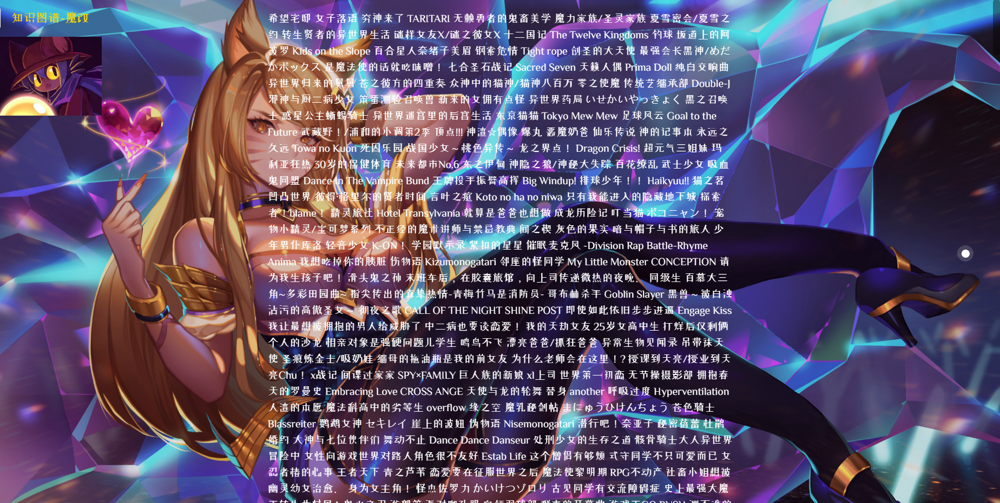
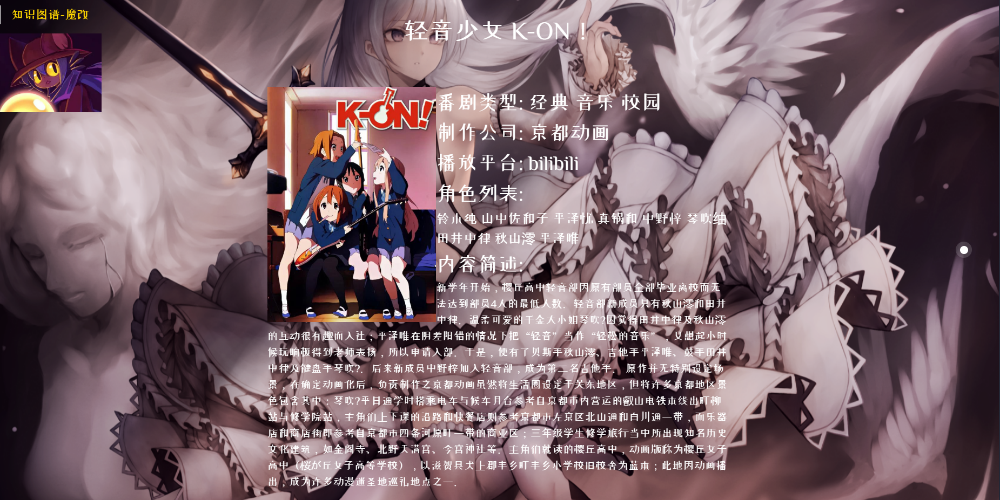

## 知识图谱实践项目四

对爬虫和知识图谱进行了简单的升级，扩展了爬取的信息

爬虫：

```python
# -*- coding: utf-8 -*-#

import os
from time import sleep
from lxml import etree
import requests, re
from urllib.parse import urljoin, urlencode
from bs4 import BeautifulSoup

headers = {
    'Accept': '',
    'Cookie': '',
    'User-Agent': ''
}

class Crawler:
    target_url = 'https://www.bnacg.com/dm/list_1_'
    base_url = ''
    name_file = 0
    platform_file = 0
    seiyuu_file = 0
    classify_file = 0
    role_name_file = 0
    role_img_file = 0
    author_file = 0
    content_file = 0

    def get_base_html(self,url):
        res = requests.get(url,headers)
        text = res.text.encode('ISO-8859-1').decode('utf-8')
        return text

    def create_list(self):
        base_html = self.get_base_html(self.base_url)
        soup = BeautifulSoup(base_html, 'html.parser')
        html = soup.findAll("ul", {"class": "result-list"})
        url_list = re.findall('<a class="img-wrap" href="(.*?)" rel="nofollow"', str(html))

        name_list = []
        name_img_list = []
        author_list = []
        role_img_list = []
        role_name_list = []
        classify_list = []
        seiyuu_list =[]
        platform_list = []
        content_list = []
        role_content_list = []
        time_list = []

        for url in url_list:
            url_html = self.get_base_html(url)

            name = re.findall('<div class="ts18 bold"> (.*?) /', str(url_html))
            classify = re.findall('<div class="rw_ju"> <span class="bold">类型：</span>(.*?)</div>',url_html)
            role_name = re.findall('title="(.*?)" alt="',url_html)
            role_img = re.findall(' <span class="bold">人物配音：</span>(.*?)</div>',url_html)
            author = re.findall('<dd class="canshu value">(.*?)</dd>',url_html)
            role_content = re.findall('：</span>(.*?)</div>',url_html)
            content = []

            soup = BeautifulSoup(url_html, 'html.parser')
            div = soup.find("div", {"class": "juqing"})
            p = div.findChildren("p", {"style": ""},recursive=False)

            for i in range(len(p)):
                p[i] = re.sub('<strong>(.*?)</strong>',"",str(p[i]))
                content.append(str(p[i]).replace("\u3000","").replace("\r","").replace("\n","").replace("\t","")[3:-4])

            for i in range(len(role_name)):
                role_name[i] = str(role_name[i]).replace(" ","")

            for i in range(len(role_content)):
                role_content[i] = str(role_content[i]).replace(' ', '')

            del role_content[0: 7]
            time = role_content[0]
            role_content.pop(0)

            name_list.append(name[0])
            role_img_list.append(role_img[1:])
            role_name_list.append(role_name)
            if (len(author)<4):
                author=["无","无","无","无"]
            author_list.append(author[2])
            platform_list.append(author[3])
            seiyuu_list.append(seiyuu)
            content_list.append(content)
            name_img_list.append(name_img[0])
            role_content_list.append(role_content)
            time_list.append(time)

            if(len(classify) != 0):
                classify_list.append(classify[0].split(','))

        #for i in list(zip(name_list,author_list,platform_list,classify_list,seiyuu_list,role_name_list,role_img_list)):
            #print(i)

        for i in range(len(name_list)):
            self.name_file.write(str(name_list[i].replace('《', '').replace('》', '')) + "\n")
            self.author_file.write(str(author_list[i].replace(' ','')) + "\n")
            self.platform_file.write(str(platform_list[i].replace(' ','')) + "\n")
            self.classify_file.write(str(classify_list[i])[1:-1].replace('\'','').replace(',','') + "\n")
            self.seiyuu_file.write(str(seiyuu_list[i])[1:-1].replace('\'', '').replace(',', '') + "\n")
            self.role_name_file.write(str(role_name_list[i])[1:-1].replace('\'', '').replace(',', '') + "\n")
            self.role_img_file.write(str(role_img_list[i])[1:-1].replace('\'', '').replace(',', '') + "\n")
            self.content_file.write(str(content_list[i])[1:-1].replace('\'', '').replace(',', '') + "\n")
            self.name_img_file.write(str(name_img_list[i].replace(' ','')) + "\n")
            self.time_file.write(str(time_list[i].replace(' ','')) + "\n")
            self.role_content_file.write(str(role_content_list[i])[1:-1].replace('\'', '').replace(',', '') + "\n")

    def run(self):
        self.name_file = open('data/name.txt', 'w', encoding='utf8')
        self.author_file = open('data/author.txt', 'w', encoding='utf8')
        self.role_name_file = open('data/role_name.txt', 'w', encoding='utf8')
        self.role_img_file = open('data/role_img.txt', 'w', encoding='utf8')
        self.platform_file = open('data/platform.txt', 'w', encoding='utf8')
        self.seiyuu_file = open('data/seiyuu.txt', 'w', encoding='utf8')
        self.classify_file = open('data/classify.txt', 'w', encoding='utf8')
        self.content_file = open('data/content.txt','w',encoding='utf8')
        self.name_img_file = open('data/name_img.txt','w',encoding='utf8')
        self.role_content_file = open('data/role_content.txt','w',encoding='utf8')
        self.time_file = open('data/time.txt','w',encoding='utf8')

        for i in range(57):
            self.base_url = self.target_url + str(i+1) + ".html"
            print("Now is: " + self.base_url)
            self.create_list()

    def test(self):
        res = requests.get(self.target_url, headers)
        print(res.encoding)

if __name__ == '__main__':
    cra = Crawler()
    cra.run()
```

知识图谱：

```python
# -*- coding: utf-8 -*-#

from py2neo import Graph,Node,Relationship
import os

classification = ['番剧名称','番剧类型','角色列表','声优列表','播放平台','制作公司']

class KG:
    name_file = open('data/name.txt', 'r', encoding='utf8')
    name_img_file = open('data/name_img.txt', 'r', encoding='utf8')
    time_file = open('data/time.txt', 'r', encoding='utf8')
    platform_file = open('data/platform.txt', 'r', encoding='utf8')
    author_file = open('data/author.txt', 'r', encoding='utf8')
    role_img_file = open('data/role_img.txt', 'r', encoding='utf8')
    role_name_file = open('data/role_name.txt', 'r', encoding='utf8')
    role_content_file = open('data/role_content.txt', 'r', encoding='utf8')
    seiyuu_file = open('data/seiyuu.txt', 'r', encoding='utf8')
    classify_file = open('data/classify.txt', 'r', encoding='utf8')
    content_file = open('data/content.txt', 'r', encoding='utf8')

    def createEntity(self,graph):
        cql = '''CREATE (n:番剧数据库{id:'0', name:'番剧数据库'}) RETURN n'''
        graph.run(cql)

        for i, c in enumerate(classification):
            cql = '''
                MERGE (a:番剧数据库{id:'%d', name:'%s'})
                MERGE (b {name: '番剧数据库'}) 
                MERGE (b)-[:划分]->(a)
                ''' % (i+1, c)
            graph.run(cql)

        name_list = self.name_file.readlines()
        name_img_list = self.name_img_file.readlines()
        author_list = self.author_file.readlines()
        platform_list = self.platform_file.readlines()
        content_list = self.content_file.readlines()

        for i in range(len(name_list)):
            cql = """
                MERGE (:番剧名称{id:'%d',名称:"%s",图片:'%s',内容:'%s'})
                """ % (i, name_list[i].replace('\n',''),
                       name_img_list[i].replace('\n',''),
                       content_list[i].replace('\n',''))
            graph.run(cql)

        print("step 1 down")

        author_tmp_list = []
        platform_tmp_list = []
        for i in range(len(name_list)):
            if author_list[i] not in author_tmp_list:
                author_tmp_list.append(author_list[i])
                cql = """
                    MERGE (:制作公司{id:'%d', 名称:"%s"})
                    """ % (i, author_list[i].replace('\n',''))
                graph.run(cql)
            if platform_list[i] not in platform_tmp_list:
                platform_tmp_list.append(platform_list[i])
                cql = """
                    MERGE (:播放平台{id:'%d', 名称:"%s"})
                    """ % (i, platform_list[i].replace('\n', ''))
                graph.run(cql)

        print("step 2 down")

        classify_tmp_list = []
        seiyuu_tmp_list = []
        for i in range(len(name_list)):
            classify_list = self.classify_file.readline().split(' ')
            seiyuu_list = self.seiyuu_file.readline().split(' ')
            role_name_list = self.role_name_file.readline().split(' ')
            role_img_list = self.role_img_file.readline().split(' ')
            role_content_list = self.role_content_file.readline().split(' ')

            for j in range(len(classify_list)):
                if classify_list[j] not in classify_tmp_list:
                    classify_tmp_list.append(classify_list[j])
                    cql = """
                        MERGE (:番剧类型{类型:'%s'})
                        """ % (classify_list[j].replace('\n',''))
                    graph.run(cql)
            for j in range(len(seiyuu_list)):
                if seiyuu_list[j] not in seiyuu_tmp_list:
                    seiyuu_tmp_list.append(seiyuu_list[j])
                    cql = """
                        MERGE (:声优列表{名称:'%s'})
                        """ % (seiyuu_list[j].replace('\n',''))
                    graph.run(cql)
            for j in range(len(role_name_list)):
                if (len(role_name_list)!=len(role_img_list)):
                    print("wrong img:"+role_name_list[j])
                if (len(role_content_list)<4):
                    break
                cql = """
                    MERGE (:角色列表{名称:'%s',图片:'%s',性别:'%s',身份:'%s',特征:'%s',配音:'%s'})
                    """ % (role_name_list[j].replace('\n',''),
                           role_img_list[j].replace('\n',''),
                           role_content_list[j * 4 + 0].replace('\n', ''),
                           role_content_list[j * 4 + 1].replace('\n', ''),
                           role_content_list[j * 4 + 2].replace('\n', ''),
                           role_content_list[j * 4 + 3].replace('\n', ''))
                graph.run(cql)

        print("step 3 down")

    def createreRationship(self,graph):
        self.name_file.seek(0)
        self.seiyuu_file.seek(0)
        self.platform_file.seek(0)
        self.role_name_file.seek(0)
        self.role_img_file.seek(0)
        self.author_file.seek(0)
        self.classify_file.seek(0)

        name_list = self.name_file.readlines()
        author_list = self.author_file.readlines()
        platform_list = self.platform_file.readlines()

        for i in range(len(name_list)):
            classify_list = self.classify_file.readline().split(' ')
            role_name_list = self.role_name_file.readline().split(' ')
            role_img_list = self.role_img_file.readline().split(' ')
            seiyuu_list = self.seiyuu_file.readline().split(' ')

            for j in range(len(classify_list)-1):
                cql = """
                    MATCH (a:番剧名称{id:'%d', 名称:"%s"}),
                          (b:番剧类型{类型:'%s'})
                    MERGE (b)-[:类型]->(a)
                """ % (i,name_list[i].replace('\n',''),
                       classify_list[j].replace('\n',''))
                graph.run(cql)

            for j in range(len(role_name_list)):
                cql = """
                    MATCH (a:番剧名称{id:'%d', 名称:"%s"}),
                          (b:角色列表{名称:'%s',图片:'%s'})
                    MERGE (b)-[:属于]->(a)
                """ % (i,name_list[i].replace('\n',''),
                       role_name_list[j].replace('\n',''),
                       role_img_list[j].replace('\n',''))
                graph.run(cql)

                cql = """
                    MATCH (a:声优列表{名称:"%s"}),
                          (b:角色列表{名称:'%s',图片:'%s'})
                    MERGE (a)-[:配音]->(b)
                """ % (seiyuu_list[j].replace('\n', ''),
                       role_name_list[j].replace('\n', ''),
                       role_img_list[j].replace('\n', ''))
                graph.run(cql)

            cql = """
                MATCH (a:番剧名称{id:'%d', 名称:"%s"}),
                      (b:制作公司{名称:"%s"})
                MERGE (b)-[:制作]->(a)
            """ % (i,name_list[i].replace('\n',''),
                   author_list[i].replace('\n',''))
            graph.run(cql)

            cql = """
                MATCH (a:番剧名称{id:'%d', 名称:"%s"}),
                      (b:播放平台{名称:"%s"})
                MERGE (b)-[:播放]->(a)
            """ % (i,name_list[i].replace('\n',''),
                   platform_list[i].replace('\n',''))
            graph.run(cql)

        print("step 4 down")

if __name__ == '__main__':
    test_graph = Graph("http://127.0.0.1:7474/browser/", auth=("neo4j", "123456789"))
    test_graph.run('match(n) detach delete n')
    kg = KG()
    kg.createEntity(test_graph)
    kg.createreRationship(test_graph)
```

新设计了一个功能，使其可以列出知识图谱中所有的 `番剧名称` 实体：

 

点击某个 `番剧名称` 实体可以查看其详细信息：

 

点击角色列表中的 `角色` 实体，可以查看该实体的信息：

 


